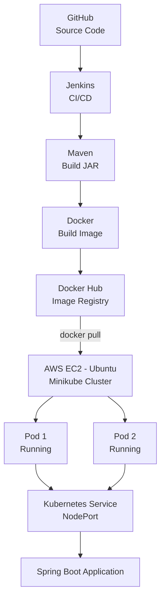

<div align="center">

# 🚀 End-to-End DevOps CI/CD Pipeline
### Jenkins • Docker • Kubernetes • AWS EC2

A hands-on DevOps project implementing a complete CI/CD workflow — from source code to a running, replicated application on Kubernetes.


</div>

---

## 📌 Project Overview

The goal of this project was to gain **practical, hands-on experience** with an end-to-end DevOps workflow — not by learning tools in isolation, but by integrating them into one continuous pipeline.

Source code stored in **GitHub** flows through **Jenkins CI/CD automation**, gets packaged with **Maven**, containerized with **Docker**, published to **Docker Hub**, and finally deployed on **Kubernetes**.

**Tech Stack:** AWS EC2 · Linux · Git · GitHub · Jenkins · Maven · Java 21 · Spring Boot · Docker · Docker Hub · Kubernetes · Minikube · kubectl

---

## 📖 Table of Contents

- [Workflow](#-complete-devops-workflow)
- [Architecture](#️-project-architecture)
- [AWS EC2 Setup](#️-aws-ec2)
- [Jenkins Pipeline](#️-jenkins)
- [Docker](#-docker)
- [Kubernetes](#-kubernetes)
- [Troubleshooting](#️-troubleshooting-experience)
- [Security Practices](#-security-practices)
- [Project Structure](#-project-structure)
- [Key Files](#-important-project-files)
- [Commands Reference](#-important-commands)
- [Results](#-final-project-results)
- [What I Learned](#-what-i-learned-from-this-project)
- [Future Improvements](#-future-improvements)
- [Author](#-author)

- 
## 🏗️ Project Architecture



---

## ☁️ AWS EC2

Two separate EC2 environments were used:

| Server | OS | Instance Type | RAM | Port |
|---|---|---|---|---|
| **Jenkins Server** | Amazon Linux 2023 | t3.small | 2 GB | 8080 |
| **Kubernetes Server** | Ubuntu | c7i-flex.large | ~4 GB | — |

**AWS concepts practiced:** EC2 instance creation, instance types, SSH access, security groups, inbound ports, resource monitoring, cloud infrastructure management.

---

## 🐧 Linux

**Concepts learned:** SSH, users & groups, file permissions, directory structure, environment variables, processes, services, package installation, disk & memory monitoring, networking, troubleshooting.

**Commands practiced:** `ls` `cd` `pwd` `mkdir` `rm` `cp` `mv` `cat` `nano` `chmod` `chown` `ps` `top` `free` `df` `curl` `ssh`

**Service management:** `systemctl status/start/restart/enable`, `journalctl`

---

## 🔀 Git & GitHub

**Repository:** [`Kishanxkumar/jenkins-docker-project`](https://github.com/Kishanxkumar/jenkins-docker-project)

```bash
git init
git status
git add .
git commit -m "commit message"
git branch -M main
git remote -v
git push -u origin main
git pull
git log
```

GitHub acts as the source for the Jenkins CI/CD pipeline.

---

## ☕ Java 21 & 🌱 Spring Boot

The application started as a simple short-lived Java program and was converted into a **long-running Spring Boot web application** — a key fix that resolved a Kubernetes crash loop (see [Troubleshooting](#️-troubleshooting-experience)).

| Property | Value |
|---|---|
| Endpoint | `GET /` |
| Response | `Hello from Jenkins + Docker + Kubernetes!` |
| Port | `8080` |

---

## 📦 Maven

- **Version:** 3.9.16
- **Install path:** `/opt/maven`
- **Build command:**
```bash
mvn clean package
```
- **Artifact produced:** `target/jenkins-docker-project-1.0.jar`

---

## ⚙️ Jenkins

Jenkins was installed on an EC2 instance and configured to automate builds and Docker image creation.

**Pipeline flow:**

### 📄 Jenkinsfile

```groovy
pipeline {
    agent any

    tools {
        maven 'Maven-3.9.16'
    }

    stages {

        stage('Checkout') {
            steps {
                git branch: 'main',
                    url: 'https://github.com/Kishanxkumar/jenkins-docker-project.git'
            }
        }

        stage('Maven Build') {
            steps {
                sh 'mvn clean package'
            }
        }

        stage('Docker Build & Push') {
            steps {
                withCredentials([
                    usernamePassword(
                        credentialsId: 'dockerhub-credentials',
                        usernameVariable: 'DOCKER_USER',
                        passwordVariable: 'DOCKER_PASS'
                    )
                ]) {
                    sh 'chmod +x build-and-push.sh'
                    sh './build-and-push.sh'
                }
            }
        }
    }
}
```

**Workspace:** `/var/lib/jenkins/workspace/jenkins-docker-pipeline`

### 🔐 Jenkins Credentials

Docker Hub authentication is handled securely via Jenkins Credentials (ID: `dockerhub-credentials`) — no secrets are hard-coded into the pipeline.

```groovy
withCredentials([
    usernamePassword(
        credentialsId: 'dockerhub-credentials',
        usernameVariable: 'DOCKER_USER',
        passwordVariable: 'DOCKER_PASS'
    )
])
```

---

## 🐳 Docker

### 📄 Dockerfile

```dockerfile
FROM eclipse-temurin:21-jre

COPY target/jenkins-docker-project-1.0.jar /app.jar

EXPOSE 8080

ENTRYPOINT ["java", "-jar", "/app.jar"]
```

### 🧪 Local Testing

```bash
docker build -t jenkins-docker-project:test .
docker run --rm -p 8081:8080 jenkins-docker-project:test
curl http://localhost:8081/
# → Hello from Jenkins + Docker + Kubernetes!
```

### 🐋 Docker Hub

**Repository:** [`kishan272/jenkins-docker-project`](https://hub.docker.com/r/kishan272/jenkins-docker-project)

Images are tagged with the **Jenkins build number** (e.g. `:5`) as well as `:latest`, avoiding reliance on `latest` alone.

### 🔄 build-and-push.sh

```bash
#!/bin/bash

set -e

IMAGE_NAME="kishan272/jenkins-docker-project"
IMAGE_TAG="${BUILD_NUMBER:-1}"

echo "Building Docker image..."
docker build -t "$IMAGE_NAME:$IMAGE_TAG" .

echo "Tagging image as latest..."
docker tag "$IMAGE_NAME:$IMAGE_TAG" "$IMAGE_NAME:latest"

echo "Logging in to Docker Hub..."
printf '%s' "$DOCKER_PASS" | docker login \
  -u "$DOCKER_USER" \
  --password-stdin

echo "Pushing image..."
docker push "$IMAGE_NAME:$IMAGE_TAG"

echo "Pushing latest tag..."
docker push "$IMAGE_NAME:latest"

docker logout

echo "Docker image pushed successfully!"
echo "Image: $IMAGE_NAME:$IMAGE_TAG"
```

---

## ☸️ Kubernetes

Deployed on a **Minikube** cluster (v1.39.0) running on the Kubernetes EC2 server, using the Docker driver.

```bash
minikube start --driver=docker
minikube status
kubectl get nodes   # STATUS: Ready
```

### 📄 deployment.yaml

```yaml
apiVersion: apps/v1
kind: Deployment
metadata:
  name: jenkins-docker-app
spec:
  replicas: 2
  selector:
    matchLabels:
      app: jenkins-docker-app
  template:
    metadata:
      labels:
        app: jenkins-docker-app
    spec:
      containers:
        - name: jenkins-docker-app
          image: kishan272/jenkins-docker-project:5
          ports:
            - containerPort: 8080
```

### 📄 service.yaml

```yaml
apiVersion: v1
kind: Service
metadata:
  name: jenkins-docker-service
spec:
  selector:
    app: jenkins-docker-app
  ports:
    - protocol: TCP
      port: 80
      targetPort: 8080
  type: NodePort
```

### 🔌 Result 


**Access flow:** `Browser → EC2 → NodePort/Port-Forward → Service → Pod → Spring Boot → Port 8080`

---

## 🛠️ Troubleshooting Experience

Real infrastructure issues encountered and resolved during this project.

<details>
<summary><strong>1. Jenkins Node Offline (disk space)</strong></summary>

**Problem:** Jenkins showed `Waiting for next available executor` — the built-in node went offline due to low `/tmp` disk space.
**Fix:** Adjusted temp disk thresholds (Free: 100 MiB, Warning: 200 MiB).
</details>

<details>
<summary><strong>2. EC2 Memory Limitation</strong></summary>

**Problem:** `t3.micro` (1 GB RAM) caused extreme slowness during Maven builds.
**Fix:** Upgraded to `t3.small` (2 GB RAM) — pipeline completed successfully.
</details>

<details>
<summary><strong>3. Jenkins Docker Permission Denied</strong></summary>

**Problem:** Jenkins couldn't communicate with the Docker daemon.
**Fix:**
```bash
sudo usermod -aG docker jenkins
sudo systemctl restart jenkins
sudo -u jenkins docker ps   # verify
```
</details>

<details>
<summary><strong>4. Kubernetes CrashLoopBackOff</strong></summary>

**Problem:** The original Java app printed a message and exited immediately. Kubernetes kept restarting the container (`Completed` → `CrashLoopBackOff`), since Deployments expect long-running processes.
**Fix:** Converted the app into a Spring Boot service with an embedded Tomcat server listening continuously on port `8080`.
```bash
kubectl delete deployment jenkins-docker-app
```
</details>

<details>
<summary><strong>5. Minikube Cluster Recovery</strong></summary>

**Problem:** After restarting the EC2 instance, the Minikube cluster was stopped.
**Fix:**
```bash
minikube start --driver=docker
minikube status
kubectl get nodes   # → Ready
```
</details>

**Debugging approach used throughout:**

---

## 📄 Important Project Files

<details>
<summary><strong>pom.xml</strong></summary>

```xml
<project xmlns="http://maven.apache.org/POM/4.0.0"
         xmlns:xsi="http://www.w3.org/2001/XMLSchema-instance"
         xsi:schemaLocation="http://maven.apache.org/POM/4.0.0
         https://maven.apache.org/xsd/maven-4.0.0.xsd">

    <modelVersion>4.0.0</modelVersion>

    <parent>
        <groupId>org.springframework.boot</groupId>
        <artifactId>spring-boot-starter-parent</artifactId>
        <version>3.5.6</version>
        <relativePath/>
    </parent>

    <groupId>com.example</groupId>
    <artifactId>jenkins-docker-project</artifactId>
    <version>1.0</version>

    <properties>
        <java.version>21</java.version>
    </properties>

    <dependencies>
        <dependency>
            <groupId>org.springframework.boot</groupId>
            <artifactId>spring-boot-starter-web</artifactId>
        </dependency>
    </dependencies>

    <build>
        <plugins>
            <plugin>
                <groupId>org.springframework.boot</groupId>
                <artifactId>spring-boot-maven-plugin</artifactId>
            </plugin>
        </plugins>
    </build>

</project>
```
</details>

<details>
<summary><strong>App.java</strong></summary>

```java
package com.example;

import org.springframework.boot.SpringApplication;
import org.springframework.boot.autoconfigure.SpringBootApplication;
import org.springframework.web.bind.annotation.GetMapping;
import org.springframework.web.bind.annotation.RestController;

@SpringBootApplication
@RestController
public class App {

    public static void main(String[] args) {
        SpringApplication.run(App.class, args);
    }

    @GetMapping("/")
    public String home() {
        return "Hello from Jenkins + Docker + Kubernetes!";
    }
}
```
</details>

---

## 🧪 Important Commands

<details>
<summary><strong>Git</strong></summary>

```bash
git init
git status
git add .
git commit -m "commit message"
git branch -M main
git remote -v
git push -u origin main
git pull
git log
```
</details>

<details>
<summary><strong>Maven & Java</strong></summary>

```bash
mvn -version
mvn clean package
java -version
java -jar target/jenkins-docker-project-1.0.jar
```
</details>

<details>
<summary><strong>Docker</strong></summary>

```bash
docker --version
docker ps
docker images
docker build -t image-name .
docker run --rm -p 8081:8080 image-name
docker tag image-name repository/image:tag
docker push repository/image:tag
docker pull repository/image:tag
docker login
docker logout
docker inspect
```
</details>

<details>
<summary><strong>Kubernetes / Minikube</strong></summary>

```bash
kubectl get nodes
kubectl get pods -o wide
kubectl get deployments
kubectl get svc
kubectl apply -f deployment.yaml
kubectl apply -f service.yaml
kubectl delete deployment jenkins-docker-app
kubectl port-forward service/jenkins-docker-service 8080:80 --address 0.0.0.0

minikube start --driver=docker
minikube status
minikube service jenkins-docker-service --url
```
</details>

---

## 📊 Final Project Results

| Milestone | Status |
|---|---|
| AWS EC2 Infrastructure | ✅ |
| Git & GitHub | ✅ |
| Jenkins CI/CD Pipeline | ✅ |
| Maven Build Automation | ✅ |
| Java 21 + Spring Boot | ✅ |
| Docker Containerization | ✅ |
| Docker Hub Registry + Versioning | ✅ |
| Kubernetes Cluster (Minikube) | ✅ |
| Deployment — 2 Replicas Running | ✅ |
| Kubernetes Service (NodePort) | ✅ |
| End-to-End Application Access | ✅ |
| Real-World Troubleshooting | ✅ |

**Final response verified at every stage:** 


---

## 🧠 What I Learned From This Project

This project moved me from *learning individual DevOps tools* to *understanding how they work together* in a real deployment pipeline:

- **Git & GitHub** — version control and acting as a CI/CD source.
- **Jenkins** — jobs, builds, pipelines, credentials, executors, and automation.
- **Maven** — dependency management and packaging Java apps into JARs.
- **Docker** — building, tagging, and distributing containerized apps.
- **Docker Hub** — image versioning beyond just `latest`.
- **Kubernetes** — Pods, Deployments, ReplicaSets, Services, and NodePort exposure.
- **AWS** — sizing infrastructure and how resources affect build performance.
- **Linux** — permissions, services, processes, and networking.
- **Troubleshooting** — the real skill: `Problem → Observation → Logs → Root Cause → Solution → Verification`.

---

## 🔮 Future Improvements

- [ ] GitHub Webhooks for automatic Jenkins triggering
- [ ] Automated Kubernetes deployment from Jenkins
- [ ] Terraform for AWS infrastructure provisioning
- [ ] Migrate to Amazon EKS
- [ ] Kubernetes Ingress, ConfigMaps & Secrets
- [ ] Prometheus + Grafana monitoring
- [ ] SonarQube code quality checks
- [ ] Trivy container image scanning
- [ ] Liveness & readiness probes
- [ ] Horizontal Pod Autoscaling
- [ ] Centralized logging
- [ ] CI/CD notifications

### 🚀 Future Architecture

```mermaid
flowchart LR
    A[Developer] --> B[GitHub]
    B --> C[Webhook]
    C --> D[Jenkins]
    D --> E[Maven Build]
    E --> F[Docker Build]
    F --> G[Security Scan]
    G --> H[Docker Hub]
    H --> I[Kubernetes / EKS]
    I --> J[Deployment]
    J --> K[Service / Ingress]
    K --> L[Application]
    L --> M[Prometheus]
    M --> N[Grafana]
```



---

## 👨‍💻 Author

**Kishan Kumar N**
*Aspiring Cloud & DevOps Engineer*

`AWS` `Linux` `Git` `GitHub` `Jenkins` `Docker` `Docker Hub` `Kubernetes` `Minikube` `kubectl` `Maven` `Java 21` `Spring Boot` `CI/CD` `Terraform`

---

<div align="center">

**#DevOps #AWS #Jenkins #Docker #Kubernetes #CI/CD #Linux #Git #GitHub #Maven #Java #SpringBoot #CloudEngineer**

</div>

---

## 🔄 Complete DevOps Workflow
